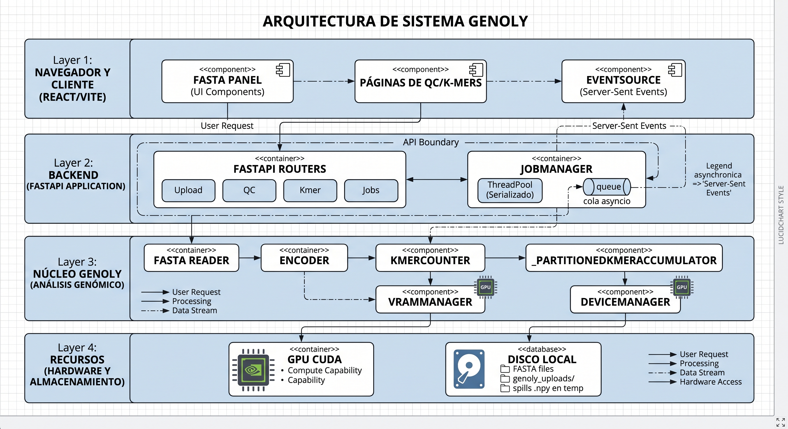
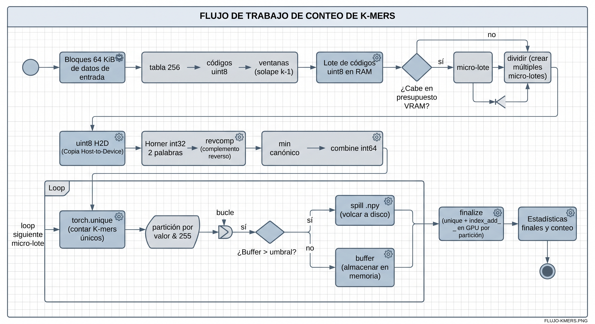

# Arquitectura de Genoly-GPU

> Documento técnico: qué componentes existen, cómo se conectan y **por qué**
> se diseñaron así. La motivación de producto (qué problema resuelve el
> software frente a las herramientas tradicionales) está en
> [que-es-genoly.md](que-es-genoly.md). Los detalles finos de implementación
> viven en los docstrings del código.



## 1. Visión general

Genoly-GPU es un pipeline de análisis genómico dividido en tres capas:

```
┌──────────────────────────────────────────────────────────────────┐
│  Presentación    React + Vite (SPA) — progreso en tiempo real    │
├──────────────────────────────────────────────────────────────────┤
│  API             FastAPI: routers por módulo, trabajos de fondo  │
│                  con progreso SSE, subida de archivos en streaming│
├──────────────────────────────────────────────────────────────────┤
│  Núcleo Genoly   I/O por bloques → codificación → cómputo GPU    │
│                  con gestión dinámica de VRAM y agregación       │
│                  particionada con derrame a disco                │
└──────────────────────────────────────────────────────────────────┘
        │                    │                      │
     Disco local        GPU CUDA (NVIDIA)      Temporales (.npy)
   (FASTA, uploads)     (RTX de consumo)       (derrame, spills)
```

El núcleo funciona igual dentro de la API, desde un script de Python o en
Docker; la capa API existe para que un investigador sin conocimientos de
programación pueda usar el pipeline desde el navegador.

## 2. Principios de diseño

1. **Exactitud como invariante.** Ninguna optimización puede alterar el
   resultado. Cada vía rápida se verifica contra la vía clásica con tests
   de equivalencia (85 tests; los de streaming comparan conteos bit a bit
   contra referencias brute-force para k = 1…31).
2. **Memoria acotada, no "máquina grande".** El diseño asume un portátil
   con 8 GB de RAM y una GPU de consumo: un cromosoma humano debe
   procesarse sin OOM. Todo lo que crece con el tamaño de la entrada se
   derrama a disco o se trocea.
3. **Hardware de consumo, no cluster.** Las decisiones de aritmética
   (int32 frente a int64) y de transferencia (uint8) se toman para las
   características reales de las GeForce: ancho de banda de memoria
   limitado, int64 emulado a 1/32 de tasa, PCIe corto.
4. **Una sola pieza de software.** I/O, calidad, k-mers, variantes y
   genética cuantitativa comparten dispositivo, codificación y convenciones;
   no hay "pegamento" entre herramientas externas.
5. **Python/PyTorch extensible.** El laboratorio puede leer y ampliar el
   pipeline; se rechaza el C++ opaco salvo para un kernel propio futuro.

## 3. Componentes y por qué de cada uno

### 3.1 I/O en streaming — `Genoly/io/fasta.py`

**Qué hace:** lee FASTA por bloques de disco de 64 KiB, reconstruye
registros y genera ventanas sin cargar el archivo en RAM.

**Por qué existe:** un genoma completo son GB; `read()` completo o
Biopython los cargan íntegros en RAM y el proceso muere. La lectura por
bloques con decodificador UTF-8 incremental acota la memoria a
`O(bloque + mayor línea)`.

**Decisiones:**

- **Fragmentación de líneas > 1 MiB** (`max_line`): algunos FASTA "crudos"
  no tienen ajuste de línea (una sola línea de GB); sin este techo el
  buffer de línea crecería sin límite. Los fragmentos se reconstruyen
  idénticos al unirlos.
- **`iter_windows(w, overlap)`**: emite ventanas de bases directamente
  desde el flujo, sin materializar ni un registro. El solape de `k-1`
  bases garantiza que ningún k-mer quede partido entre ventanas: el conteo
  agregado es idéntico al de la secuencia entera (verificado por tests).
- **`iter_windows_codes(w, overlap)`** (ruta numérica): traduce los bytes
  del disco a dígitos base-4 con una tabla de 256 entradas y numpy, sin
  construir cadenas de Python ni decodificar texto. Reduce el parseo de
  252 MB de ~9,5 s a ~1,5 s. Semántica de códigos: `0-3` = A/C/G/T,
  `253` = salto de línea (se elimina), `254` = límite de registro, `255` =
  dígito inválido **que permanece en el stream** (N, IUPAC) para que las
  ventanas se desplacen exactamente igual que con la base presente.
- **`scan_stats()` vectorizado**: cuenta registros y bases con la misma
  tabla (sin bucles por línea) para dar a la UI los totales del progreso
  sin añadir una pasada cara.

### 3.2 Gestión dinámica de VRAM — `Genoly/core/vram.py`

**Qué hace:** mide la memoria libre de la GPU, calcula el peso en bytes
del tensor que generará la siguiente etapa y divide el lote de RAM en
micro-lotes que caben en una fracción segura de la VRAM.

**Por qué existe:** las GPUs de consumo tienen 4-8 GB compartidos con el
escritorio y otros procesos; los pipelines "estáticos" (lotes fijos) o
explotan la VRAM o la infrautilizan. `torch.cuda.mem_get_info()` mide la
VRAM **global libre del dispositivo**; por eso tras cada micro-lote se
fuerza `gc.collect() + torch.cuda.empty_cache()`: devuelve los bloques
reservados al driver y la medición siguiente refleja la realidad, evitando
fragmentación.

**Límite matemático:** para un micro-lote de `n` secuencias con padding
máximo `L` y coste `b` bytes/base:

```
bytes(micro-lote) = n · L · b  ≤  presupuesto = VRAM_libre × fracción_seguridad (0,25)
```

La fracción del 25 % deja margen para el driver, otros procesos y los
transitorios que el modelo lineal no captura (sorts, scatter). Las
secuencias individuales que exceden el presupuesto viajan solas; es
responsabilidad del ventanado que ninguna unidad lo haga.

### 3.3 Codificación — `Genoly/encoding/encoder.py`

**Qué hace:** convierte secuencias a tensores enteros u one-hot en la GPU,
y ofrece `encode_stream()` con micro-lotes adaptativos para consumir
generadores (no listas).

**Por qué:** toda la computación posterior (k-mers, GC, variantes)
trabaja sobre índices numéricos. La tabla ASCII→índice vectorizada evita
bucles por base. El padding usa el código de N, lo que hace que las
máscaras de validez cubran también el padding.

### 3.4 Conteo de k-mers — `Genoly/kmer/kmers.py`

**Qué hace:** codifica cada k-mer como entero base-4 (A=0, C=1, G=2, T=3)
mediante Horner vectorizado y cuenta frecuencias con `torch.unique`.
Es la etapa más intensiva y la que motivó la refactorización completa.

**Decisiones y por qué:**

- **Aritmética int32 de dos palabras.** Los kernels elementwise están
  limitados por ancho de banda de memoria: int64 mueve el doble de bytes
  y se midió ~2× más lento que int32 en la RTX 3050 (int64 es emulado a
  1/32 de tasa en GPUs de consumo). k ≤ 15 usa una palabra; 16 ≤ k ≤ 30
  usa `lo` (15 dígitos) + `hi` (resto) con código global `hi·4¹⁵ + lo`;
  k = 31 necesita 62 bits y cae a int64. El código global solo se combina
  a int64 una vez por micro-lote, justo antes del `unique`.
- **Transferencia uint8 con padding semántico.** Cada micro-lote sube a
  la GPU como uint8 (8× menos bytes de PCIe que int64). El padding de
  colas usa el código 255 (inválido), de modo que la máscara "todos los
  dígitos < 4" cubre gratis la semántica "ventana dentro del registro".
- **Acumulador particionado con derrame** (`_PartitionedKmerAccumulator`).
  En genomas reales casi todos los k-mers son únicos: el cromosoma 1 con
  k=21 produce ~190M de k-mers únicos ≈ 2,3 GB de resultado, más de lo que
  cabe en la RAM del equipo objetivo. El acumulador reparte cada
  micro-lote en 256 particiones por **bits bajos** del código
  (`valor & 255`): uniformes en datos genómicos y disjuntas entre sí, de
  modo que agregar cada partición de forma independiente produce el
  resultado exacto global. Cuando el buffer de una partición supera el
  umbral, se derrama a `.npy` (valores int64, conteos int32) y se libera
  la RAM. Este es el mismo principio de Jellyfish/KMC (externa al RAM)
  pero en Python y acotando también la VRAM.
- **Deduplicación final en GPU.** El `finalize` procesa partición a
  partición: tras el streaming la VRAM está libre y cada partición es
  pequeña (~total/256 filas), así que `torch.unique(return_inverse)` +
  `index_add_` en GPU cuesta milisegundos frente a los 28 s que costaba
  el re-ordenado en CPU (torch CPU sort es monohilo). Para particiones
  gigantes se trocea a `GPU_BATCH_ROWS = 32M` filas y los trozos
  resultantes (ya ordenados y únicos) se fusionan en CPU con
  `searchsorted` — O(n) sin re-ordenar.
- **Estadísticas sin materializar.** `count_fasta_aggregated()` devuelve
  solo lo que la UI necesita (total, espectro, top-k) recorriendo las
  particiones una a una: la lista completa de k-mers jamás existe en RAM.

**Alternativa rechazada:** conteo aproximado con filtros de Bloom /
Count-Min (más rápido y con memoria O(1)) — rompe el invariante de
exactitud. Un kernel CUDA propio que fusione Horner + revcomp + bucketing
es el siguiente salto posible (roadmap).

### 3.5 API y trabajos de fondo — `ui/backend/`

**Qué hace:** expone el núcleo como API REST con subida en streaming y
análisis de larga duración con progreso en tiempo real.

**Por qué:**

- **Subida por chunks asíncrona** (`upload.py`): el archivo llega como
  stream (`async for chunk`) y se escribe a disco en un hilo de fondo;
  el event loop nunca se bloquea. Las estadísticas se calculan con
  `scan_stats` en threadpool. (Nota: Starlette 1.6.0 no incorpora
  `UploadFile.chunks()`; el iterador usa `chunks()` si existe y cae a
  `await file.read(n)` si no.)
- **`jobs.py` + SSE** (`routers/jobs.py`): un análisis de minutos no puede
  bloquear el event loop ni obligar al navegador a polling ciego. El
  trabajo corre en un `ThreadPoolExecutor` **serializado** (`max_workers=1`):
  dos análisis simultáneos competirían por la misma VRAM y anularían el
  presupuesto del micro-batching. El progreso viaja por una cola `asyncio`
  alimentada de forma thread-safe (`loop.call_soon_threadsafe`) y el
  endpoint SSE la reenvía con keep-alive. Se eligió **SSE en vez de
  WebSocket** porque el flujo es unidireccional, atraviesa proxies sin
  configuración y Vite lo redirige en desarrollo.
- **Un solo worker uvicorn** (`--workers 1`): el estado de los jobs y sus
  colas vive en memoria del proceso; con varios workers el POST y el GET
  de eventos aterrizarían en procesos distintos (404) y cada proceso
  correría GPU en paralelo. El paralelismo interno se ajusta con
  `GENOLY_MAX_WORKERS`.
- **Bootstrap de `sys.path` en `main.py`**: permite arrancar con
  `uvicorn main:app` desde `ui/backend/` (con su propio venv) o con
  `python -m uvicorn ui.backend.main:app` desde la raíz, incluidos los
  procesos spawn de uvicorn.

### 3.6 Frontend — `ui/frontend/`

React + Vite + Tailwind. La página de k-mers usa la ruta asíncrona
(`count-async` + EventSource) y muestra barra de progreso (bases
procesadas/total, micro-lotes GPU, tamaño de ventana) con fallback al
endpoint síncrono si el backend no soporta trabajos. El panel de FASTA
sube al backend los archivos > 2 MB en lugar de leerlos en el navegador.

## 4. Flujo de datos del conteo de k-mers (ruta de producción)



```
bloques 64 KiB ──tabla 256──> códigos uint8 ──ventanas (solape k-1)──> lote de RAM
                                                                              │
                                                     plan_micro_batches(coste 64 B/base)
                                                                              │
                        uint8 H2D ──> int32 ──> Horner 2 palabras ──> revcomp ──> min canónico
                                                                              │
                                              combine a int64 ──> torch.unique (GPU)
                                                                              │
                                   argsort(pid, stable) ──> partición p (256) ──> buffer
                                                                              │  (spill .npy si supera umbral)
                                                        finalize: unique+index_add_ en GPU por partición
                                                                              │
                                                        estadísticas (total, espectro, top-k)
```

## 5. Invariantes que cualquier cambio debe respetar

1. Los conteos de la ruta streaming/agregada son **idénticos** a los de
   `count()` (tests de equivalencia; referencias brute-force k = 1…31).
2. `argsort(pid, stable=True)` es obligatorio: un sort inestable rompe el
   orden de los runs que exige la fusión.
3. Cada slice de micro-lote es su propio run: concatenar slices de
   micro-lotes distintos produce runs desordenados.
4. Los mmaps del derrame se cierran en `try/finally` por partición
   (Windows bloquea los ficheros abiertos) y cualquier resultado que
   apunte a un mmap se materializa antes de cerrarlo.
5. La N permanece en el stream de códigos: saltarla convertiría en
   válidos los k-mers que la cruzan.
6. k = 31 es el límite exacto (62 bits); por encima habría que cambiar a
   int128 por pares o hashing — fuera de alcance actual.

## 6. Rendimiento medido

Cromosoma 1 humano completo (NC_000001.11, 249 Mbases, 1 registro, 252 MB),
k=21 canónico, RTX 3050 6GB Laptop, 7,6 GB RAM, vía API con SSE:

| Métrica | Baseline (refactor previo) | Fase 1 (int32 + dedup GPU) | Fase 2 (pipeline numérico) |
|---|---|---|---|
| Tiempo k-mer E2E | 43,9 s (💥 OOM) | 29,1 s | **25,8 s** |
| Finalize (dedup) | 28,2 s CPU | 14,5 s | 13,3 s |
| Parseo de ventanas | 9,5 s | 9,5 s | ~1,5 s |
| RAM pico del servidor | OOM (muerte del proceso) | 3,2 GB | 2,7 GB → 342 MB |

El resultado es idéntico en todos los casos: 189.802.224 k-mers únicos,
230.478.107 instancias (verificación bit a bit).

## 7. Roadmap técnico

- **Fase 3** (aprobada): agrupar el D2H del acumulador (un transfer en vez
  de 256 slices), agrupar varias particiones por llamada de dedup en GPU
  y release selectivo (`release_every`). Esperado: ~17-19 s.
- **Fase 4** (opcional): solapar CPU y GPU (productor-consumidor) para
  esconder el coste de agregación.
- **Kernel CUDA propio** que fusione Horner + revcomp + bucketing en un
  solo lanzamiento: elimina los tensores intermedios.
- Exportación a VCF/SAM/BAM; paralelización real por lotes del alineador.

## 8. Diagramas

| Diagrama | Archivo | Estado |
|---|---|---|
| Arquitectura del sistema | `img/arquitectura-sistema.png` | ✅ incluido |
| Flujo de k-mers | `img/flujo-kmers.jpg` | ✅ incluido |
| Despliegue | `img/diagrama-despliegue.jpg` | ✅ incluido |
| Secuencia: análisis k-mer async + SSE | `img/secuencia-kmer-async.png` | pendiente (Lucidchart) |
