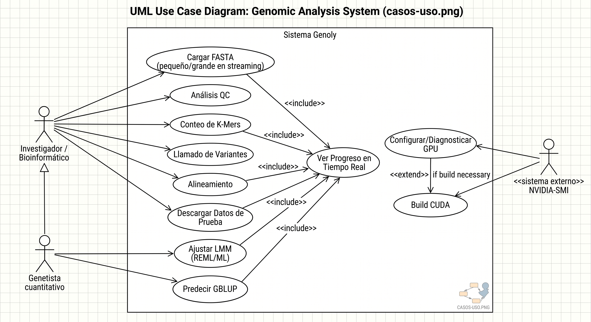

# Qué es Genoly-GPU, qué necesidad responde y en qué se diferencia

> Documento de producto: qué es el software, el problema que ataca y cómo
> se posiciona frente a las herramientas tradicionales de genómica y
> genética cuantitativa. La explicación técnica está en
> [arquitectura.md](arquitectura.md).

## 1. Qué es

Genoly-GPU es un **pipeline de análisis genómico completo que corre sobre
una GPU de consumo** (una GeForce gaming sirve) con **resultados exactos
verificados**, una **interfaz web** y **cero coste de cómputo**. Cubre la
cadena habitual de trabajo con secuencias y con datos de genética
cuantitativa:

- I/O de FASTA/FASTQ en streaming (archivos de varios GB sin llenar la RAM).
- Control de calidad: contenido GC, composición de bases, calidad Phred,
  trimming y filtrado.
- Conteo de k-mers y espectro k-mer (k ≤ 31, canónico) sobre GPU.
- Pileup y llamado de variantes (SNV, deleciones) sobre GPU.
- Alineamiento local (Smith-Waterman) sobre GPU con CIGAR y benchmark.
- Genética cuantitativa sobre GPU: modelos lineales mixtos (REML/ML),
  matriz de parentesco genómica (VanRaden/GCTA), BLUP y GBLUP con
  fiabilidad y precisión por individuo (PEV).
- Todo expuesto como librería Python (`import Genoly`), API REST y
  aplicación web.

Se distribuye como código abierto (MIT) y funciona también sin GPU (cae a
CPU automáticamente).

## 2. La necesidad: por qué existe

Tres presiones convergen en los laboratorios de genómica y mejoramiento:

1. **Los datos crecieron más rápido que el hardware de los laboratorios.**
   Un genoma completo son ~3 GB de texto; un proyecto de resecuenciación
   maneja cientos de ellos. Las herramientas clásicas asumían que había
   RAM de sobra, un cluster disponible, o ambas cosas — y el pipeline se
   cae por memoria justo cuando el estudio se vuelve interesante.
2. **El cómputo sensible no siempre puede irse a la nube.** Los datos
   genómicos son datos personales sensibles (marco legal propio en cada
   país); subirlos a un servicio de cómputo por horas cuesta dinero
   recurrente, requiere infraestructura y_skill DevOps_, y saca el dato
   del laboratorio. Un equipo de escritorio con GPU gaming — presente en
   casi cualquier laboratorio — es infraestructura infrautilizada.
3. **El trabajo real es un rompecabezas de herramientas.** La cadena
   habitual mezcla media docena de programas en C++, scripts de R y
   formato de texto intermedio, cada uno con su instalación, su CLI y sus
   supuestos. Para unirlos hace falta un perfil de bioinformática que
   muchos grupos de mejoramiento vegetal/animal o docencia no tienen.

La consecuencia práctica: **el análisis se retrasa o se externaliza**,
cuando el hardware necesario ya está sobre la mesa.

## 3. El panorama tradicional (y dónde duele)

| Tarea | Herramientas tradicionales | Cómo funcionan | Dónde duele |
|---|---|---|---|
| Calidad de lecturas | FastQC, fastp | CLI, CPU | Formatos y reportes sueltos; sin vista integrada |
| Conteo de k-mers | Jellyfish, KMC | C++, memoria externa a disco | Excelentes en escala, pero CLI, sin UI, fuera del resto del pipeline |
| Alineamiento | BWA-MEM2, minimap2 | CLI, CPU multihilo | Horas en CPU; instalar y encadenar es manual |
| Variantes | GATK, bcftools | Stack grande de Java/CLI | Curva de entrada alta; flujo multi-paso rígido |
| Genética cuantitativa | GEMMA, GCTA, GAPIT (R) | CPU; REML O(n³) | Se quedan cortas con miles de individuos/marcadores; R se queda sin RAM |
| Orquestación | Snakemake, Nextflow | Pipelines en YAML/Python | Requiere perfil DevOps/bioinformático |
| Plataformas | Galaxy, DNAnexus, Terra | Servidor / nube por horas | Coste recurrente, privacidad del dato, administración |

El patrón común: **herramientas excelentes pero fragmentadas, centradas
en CPU/cluster y pensadas para un perfil técnico**. Y un hueco concreto en
la parte de **genética cuantitativa**, donde el estándar (GEMMA/GCTA/GAPIT)
vive en R/CPU y escala mal justo en los modelos (REML, BLUP) que más
cómputo lineal exigen.

## 4. En qué se diferencia Genoly-GPU

| Dimensión | Enfoque tradicional | Genoly-GPU |
|---|---|---|
| Hardware | Cluster, servidor o nube | **GPU de consumo** (una RTX gaming) + 8-16 GB RAM |
| Exactitud | Exacta (CPU) | **Exacta y verificada** — tests de equivalencia contra referencias brute-force; nada de aproximaciones tipo Bloom |
| Memoria | "Que quepa en RAM" o memoria externa en C++ | **Streaming + derrame a disco** en Python: un cromosoma humano se procesa en un portátil de 8 GB |
| Integración | 5-8 herramientas encadenadas a mano | **Un solo paquete**: I/O → calidad → k-mers → variantes → LMM/GBLUP, con el mismo dispositivo y convenciones |
| Interfaz | CLI + scripts | **Librería Python + API REST + aplicación web** con progreso en tiempo real (SSE) |
| Genética cuantitativa | GEMMA/GCTA/GAPIT en CPU/R | **REML/ML, BLUP y GBLUP sobre GPU**, con fiabilidad y precisión por individuo, cargando fenotipos/genotipos desde CSV/Excel con limpieza automática |
| Dato | Sale del laboratorio (nube) | **Permanece local** (privacidad) |
| Coste | Licencias o cómputo por hora | **Cero** (MIT, hardware existente) |
| Extensibilidad | C++ compilado | **Python/PyTorch**: el laboratorio puede leer y ampliar el pipeline |

Tres diferencias merecen subrayarse:

- **Exactitud con velocidad.** Acelerar contando aproximado (sketches,
  filtros de Bloom) es fácil; Genoly-GPU demuestra que el conteo exacto de
  k-mers de un cromosoma humano cabe en una GPU de consumo si el diseño de
  memoria acompaña (streaming, particiones y derrame). Cada optimización
  está atada a tests que prueban que el resultado no cambia.
- **Genética cuantitativa como ciudadano de primera clase.** No es un
  añadido: el modelo animal (`y = Xβ + Zu`), la matriz de parentesco
  (VanRaden/GCTA), el BLUP y el GBLUP con fiabilidad (PEV de Henderson)
  corren sobre la misma GPU, en doble precisión por estabilidad numérica.
  Es el hueco que GEMMA/GCTA/GAPIT dejan en CPU.
- **Diseñado para la máquina que ya tienes.** El objetivo de ingeniería
  explícito es el portátil de 8 GB de RAM con una GPU de 6 GB: ese es el
  equipo de un laboratorio promedio, no un nodo de cluster.

## 5. Usuarios objetivo y casos de uso

- **Laboratorios académicos y de mejoramiento vegetal/animal**: k-mers
  para estimar tamaño de genoma y contaminación; GBLUP para predicción de
  valores de cría; todo sin mover datos a la nube.
- **Grupos sin bioinformático dedicado**: la UI web con progreso en vivo
  elimina el pegamento de CLI.
- **Docencia**: un solo entorno para enseñar de FASTA a heredabilidad,
  instalable en un portátil de aula.
- **Bioinformáticos individuales**: la librería Python permite construir
  pipelines propios sobre las mismas primitivas aceleradas.

## 6. Limitaciones actuales (honestidad de producto)

- Estado **alpha**: las APIs pueden cambiar.
- Aceleración **NVIDIA/CUDA** (sin GPU funciona en CPU, más lento).
- k-mers exactos hasta **k = 31** (límite de 62 bits en el codificador).
- El alineador Smith-Waterman es O(n·m) y su paralelización por lotes en
  GPU está en el roadmap.
- No sustituye (todavía) un cluster para bio-bancos a escala poblacional;
  el objetivo es el laboratorio individual.

## 7. Diagramas

| Diagrama | Archivo | Estado |
|---|---|---|
| Casos de uso | `img/casos-uso.jpg` | ✅ incluido |
| Despliegue | `img/diagrama-despliegue.jpg` | ✅ incluido |
| Comparativa de posicionamiento | `img/comparativa.png` | pendiente (Lucidchart) |
